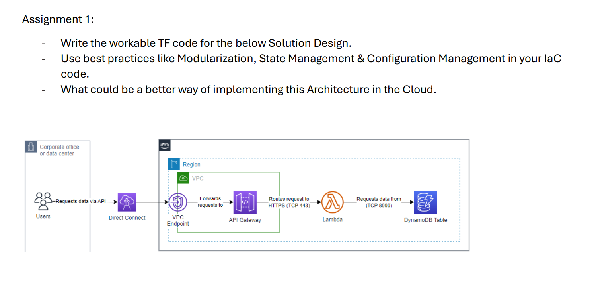

# Cloud Architecture Implementation with Terraform

### Objective
This assignment involves writing Terraform (TF) code to implement the given solution design. The key tasks are:

- Develop workable TF code for the provided architecture.
- Apply best practices such as Modularization, State Management, and Configuration Management in your Infrastructure as Code (IaC).
- Suggest and discuss potential improvements for implementing this architecture in the cloud.

### Solution Design Overview
The diagram illustrates a cloud architecture using AWS services. Here’s a breakdown of the components and data flow:

1. **Users**: Users initiate requests for data via an API.
2. **Corporate Office or Data Center**: The user requests originate from a corporate office or data center.
3. **Direct Connect**: The requests are forwarded through AWS Direct Connect, ensuring a high-speed, low-latency connection to the AWS cloud.
4. **VPC (Virtual Private Cloud)**: The requests enter the AWS VPC through a VPC endpoint.
5. **API Gateway**: The VPC endpoint forwards the requests to the API Gateway.
6. **Lambda**: The API Gateway routes the requests via HTTPS (TCP 443) to an AWS Lambda function, which processes the requests.
7. **DynamoDB Table**: The Lambda function retrieves the necessary data from an Amazon DynamoDB table over TCP (port 8000).

### Best Practices

1. **Modularization**: Organize the Terraform code into reusable modules to manage different resources effectively.
2. **State Management**: Use remote backend for storing the Terraform state to enable collaboration and maintain state consistency.
3. **Configuration Management**: Implement variables and environment-specific configurations to manage different stages of the infrastructure lifecycle.

### Improvement possible
To enhance this architecture, consider the following:

- **Auto-scaling**: Implement auto-scaling groups for Lambda functions to handle varying loads.
- **Caching**: Introduce caching mechanisms such as Amazon ElastiCache to reduce latency and improve performance.
- **Monitoring and Logging**: Integrate monitoring (Amazon CloudWatch) and logging (AWS CloudTrail) to keep track of performance and security metrics.
- **Security**: Use AWS IAM roles and policies to secure access to resources, and consider adding WAF (Web Application Firewall) for additional security.

---

